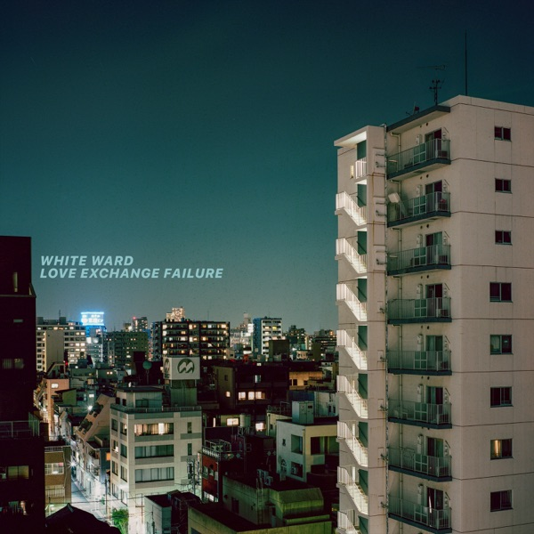
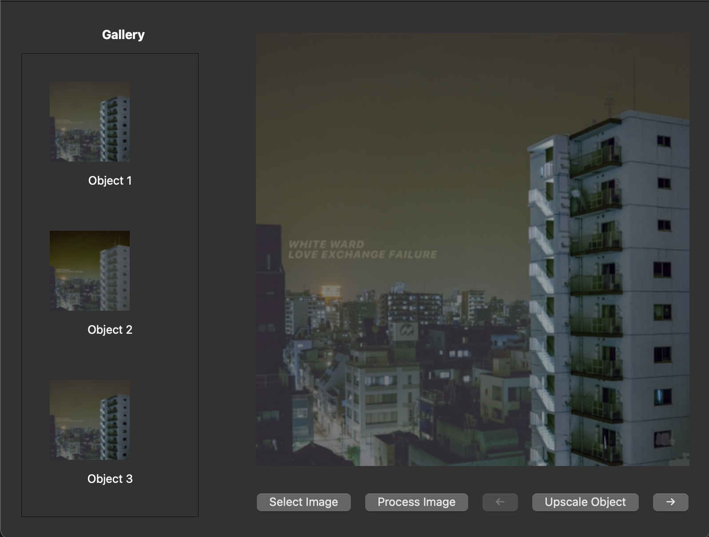
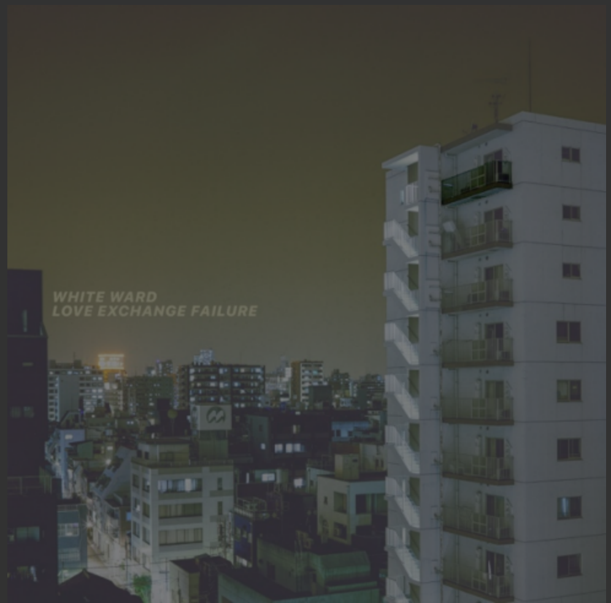
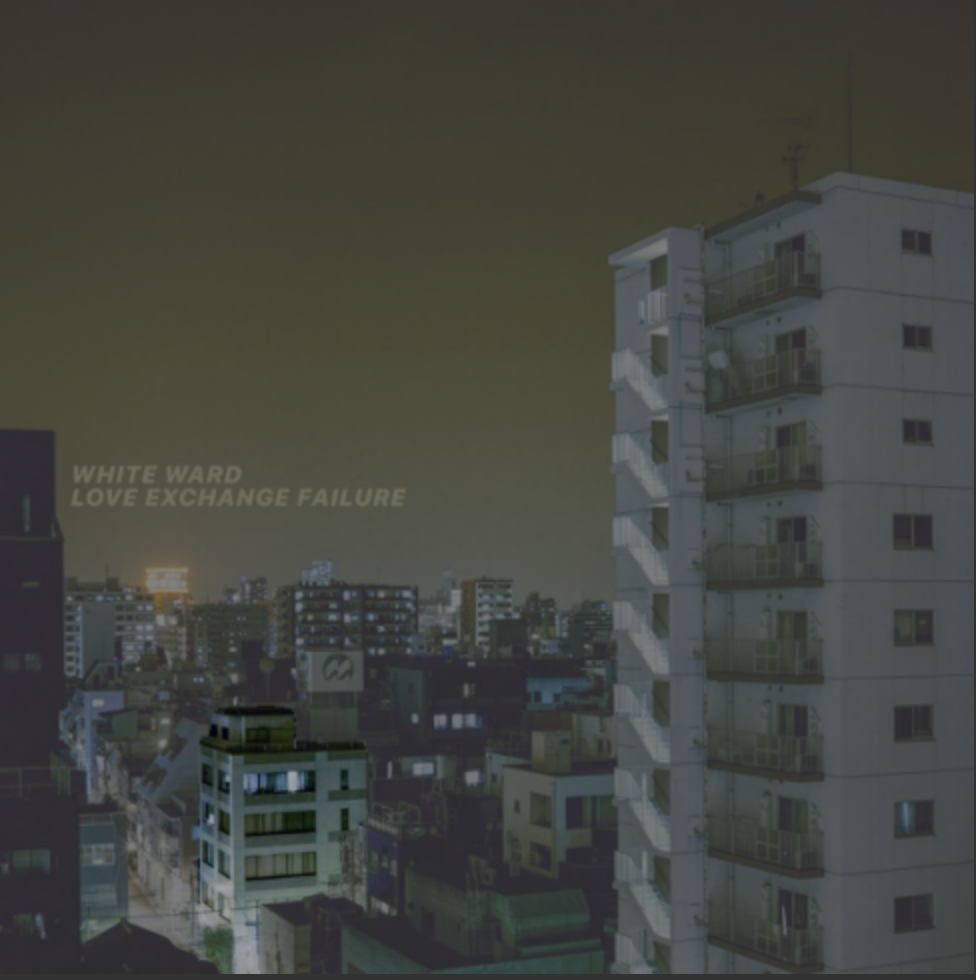
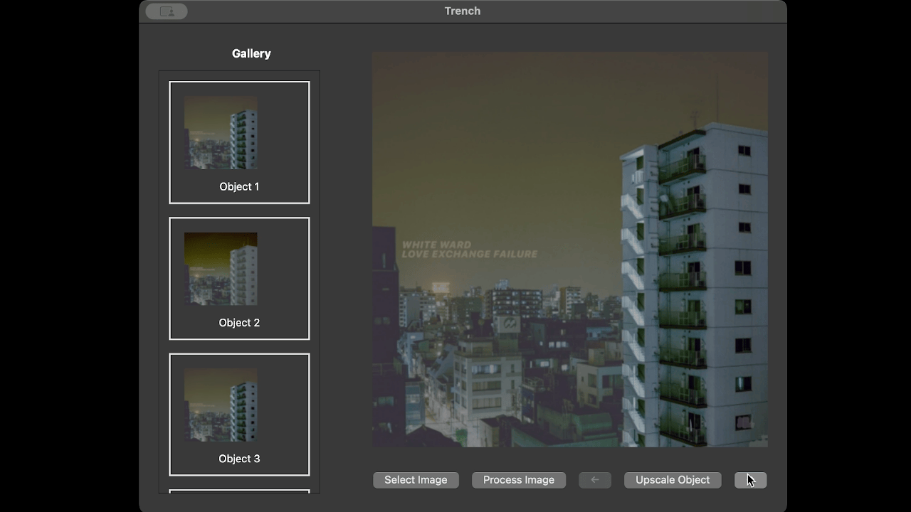
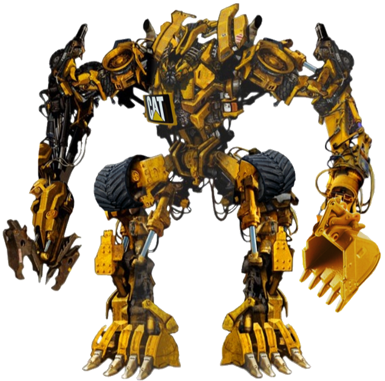

smol object extractor and upscaler gui created for my brother, essentially a wrapper for realesrgan && segment anything.
- [example](#example)
- [run](#run)
- [trench?](#trench)
### example
**ui is not final**

processing the album cover of Love Exchange Failure

there is 51 masks extracted, and each of them is highlighted upon selected by thumbnails or arrow navigation

including this balcony

or this apartment

lets extract and upscale the apartment

you can extract every small detail of images

### run
```bash
pyenv install 3.12.8
pyenv virtualenv 3.12.8 excavator
pip install pyside6 opencv-python torch torchvision basicsr realesrgan segment-anything tqdm requests
python main.py
```
### trench?
COOLEST CATERPILLAR 320 EXCAVATOR THAT HAS EVER CREATED

